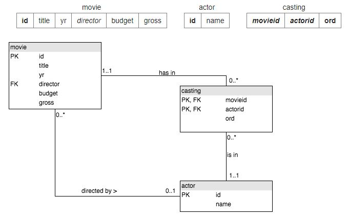

# More JOIN operations

This tutorial introduces the notion of a join. The database consists of three tables `movie` , `actor` and `casting`.



More details [here](https://sqlzoo.net/wiki/More_details_about_the_database).


1. 1962 movies
List the films where the `yr` is 1962 [Show *id*, *title*]

```
SELECT id, title
FROM movie
WHERE yr=1962
```

2. When was Citizen Kane released?

Give year of 'Citizen Kane'

```
SELECT yr 
FROM movie 
WHERE title='Citizen Kane'
```

3. Star Trek movies

List all of the Star Trek movies, include the **id**, **title** and **yr** (all of these movies include the words Star Trek in the title). Order results by year.

```
SELECT id, title, yr 
FROM movie 
WHERE title LIKE '%Star Trek%' 
ORDER BY yr
```

4. **id** for actor Glenn Close

What **id** number does the actor 'Glenn Close' have?

```
SELECT id 
FROM actor 
WHERE name = 'Glenn Close'
```

5. id for Casablanca

What is the **id** of the film 'Casablanca'

```
SELECT id 
FROM movie 
WHERE title = 'Casablanca'
```

6. Cast list for Casablanca

Obtain the cast list for 'Casablanca'.

Use movieid=11768, (or whatever value you got from the previous question)

```
SELECT name 
FROM casting JOIN actor ON actorid=id 
WHERE movieid=27
```

7. Alien cast list

Obtain the cast list for the film 'Alien'

```
SELECT name 
FROM casting JOIN actor ON casting.actorid=actor.id
JOIN movie ON movie.id=casting.movieid 
WHERE title='Alien'
```

8. Harrison Ford movies

List the films in which 'Harrison Ford' has appeared

```
SELECT title 
FROM casting JOIN actor ON casting.actorid=actor.id
JOIN movie ON movie.id=casting.movieid 
WHERE name='Harrison Ford'
```

9. Harrison Ford as a supporting actor

List the films where 'Harrison Ford' has appeared - but not in the starring role. [Note: the **ord** field of casting gives the position of the actor. If `ord=1` then this actor is in the starring role]

```
SELECT title 
FROM casting JOIN actor ON casting.actorid=actor.id
    JOIN movie ON movie.id=casting.movieid 
WHERE name='Harrison Ford' and ord<>1
```

10. Lead actors in 1962 movies

List the films together with the leading star for all 1962 films.

```
SELECT title, name 
FROM casting JOIN actor ON casting.actorid=actor.id
    JOIN movie ON movie.id=casting.movieid 
WHERE yr=1962 and ord=1
```

11. Busy years for Rock Hudson

Which were the busiest years for 'Rock Hudson', show the year and the number of movies he made each year for any year in which he made more than 2 movies.

```
SELECT yr, COUNT(title) 
FROM movie JOIN casting ON movie.id=movieid
    JOIN actor   ON actorid=actor.id
WHERE name='Rock Hudson'
GROUP BY yr
HAVING COUNT(title) > 1
```

12. Lead actor in Julie Andrews movies

List the film title and the leading actor for all of the films *Julie Andrews* played in


```
SELECT title, name 
FROM movie JOIN casting ON movie.id=movieid 
    JOIN actor ON actorid = actor.id 
WHERE movieid IN 
    (SELECT movieid FROM casting WHERE actorid IN 
        (SELECT id FROM actor WHERE name='Julie Andrews') ) 
and ord=1
```

13. Actors with 15 leading roles

Obtain a list, in alphabetical order, of actors who've had at least 15 starring roles.

```
SELECT name 
FROM casting JOIN actor ON actorid=actor.id 
    JOIN movie ON movie.id=movieid
WHERE ord=1
GROUP BY name
HAVING COUNT(*)>=15
ORDER BY name
```

14. List the films released in the year 1978 ordered by the number of actors in the cast, then by title.

```
SELECT title, count(*) 
FROM movie JOIN casting ON movie.id = movieid 
WHERE yr=1978 
GROUP BY title 
ORDER BY COUNT(*) desc, title
```

15. List all the people who have worked with 'Art Garfunkel'.

```
SELECT distinct name 
FROM casting JOIN actor ON actorid=actor.id 
WHERE movieid IN 
    (SELECT movieid FROM casting JOIN actor ON actorid = actor.id 
    WHERE name='Art Garfunkel')
AND name <>'Art Garfunkel'
```

## Quiz

1. Select the statement which lists the unfortunate directors of the movies which have caused financial loses (gross < budget)

```
SELECT name
FROM actor INNER JOIN movie ON actor.id = director
WHERE gross < budget
```

2. Select the correct example of JOINing three tables

```
SELECT *
FROM actor JOIN casting ON actor.id = actorid
    JOIN movie ON movie.id = movieid
```

3. Select the statement that shows the list of actors called 'John' by order of number of movies in which they acted

```
SELECT name, COUNT(movieid)
FROM casting JOIN actor ON actorid=actor.id
WHERE name LIKE 'John %'
GROUP BY name ORDER BY 2 DESC
```

4. Select the result that would be obtained from the following code:

```
SELECT title 
FROM movie JOIN casting ON (movieid=movie.id)
    JOIN actor ON (actorid=actor.id)
WHERE name='Paul Hogan' AND ord = 1
```

|"Crocodile" Dundee|
|Crocodile Dundee in Los Angeles|
|Flipper|
|Lightning Jack|


5. Select the statement that lists all the actors that starred in movies directed by Ridley Scott who has id 351


```
SELECT name
FROM movie JOIN casting ON movie.id = movieid
JOIN actor ON actor.id = actorid
WHERE ord = 1 AND director = 351
```

6. There are two sensible ways to connect movie and actor. They are:

```
- link the director column in movies with the primary key in actor
- connect the primary keys of movie and actor via the casting table
```

7. Select the result that would be obtained from the following code:
```
SELECT title, yr 
FROM movie, casting, actor 
WHERE name='Robert De Niro' AND movieid=movie.id AND actorid=actor.id AND ord = 3
```

|A Bronx Tale | 1993|
|Bang the Drum Slowly | 1973|
|Limitless | 2011|

##### *keep trying, knowledge is awesome*  :facepunch: